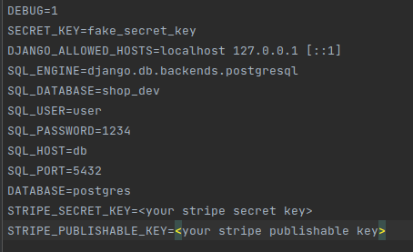
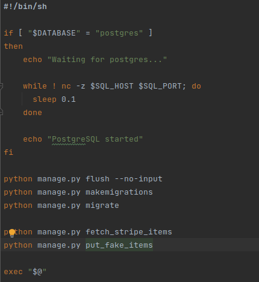

# stripe-test-assignment

Тестовое задание Django + Stripe API

## Инструкция запуска:

* Скопировать файл .env.dev.example как .env.dev
* Вставить соответствующие stripe secret key и stripe publishable key
* Запустить команду ```docker-compose up -d```

.env.dev



*Примечание*

Для упрощения, в entrypoint.sh добавлены management команды, добавляющие Items в базу:
* 10 Items из аккаунта stripe
* 10 тестовых Items

Удалить в случае ненадобности



## Эндпоинты

```GET /item/id```

Возвращает простейшую html страницу с информацией об **Item** с данным id и кнопками **Add to Cart** и **Buy**

```GET /add_to_cart/id```

Добавляет **Item** c данным id в Order ассоциированный с данным пользователем или сессией

```GET /buy```

Перенаправляет на страницу оплаты Stripe по всем выбранным продуктам из **Order**  


